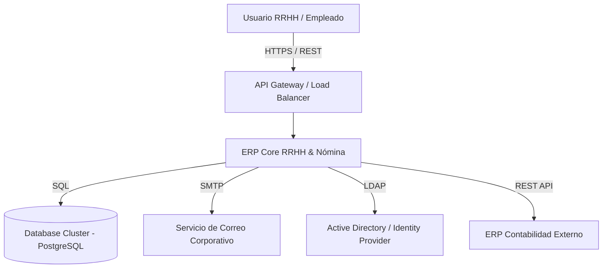
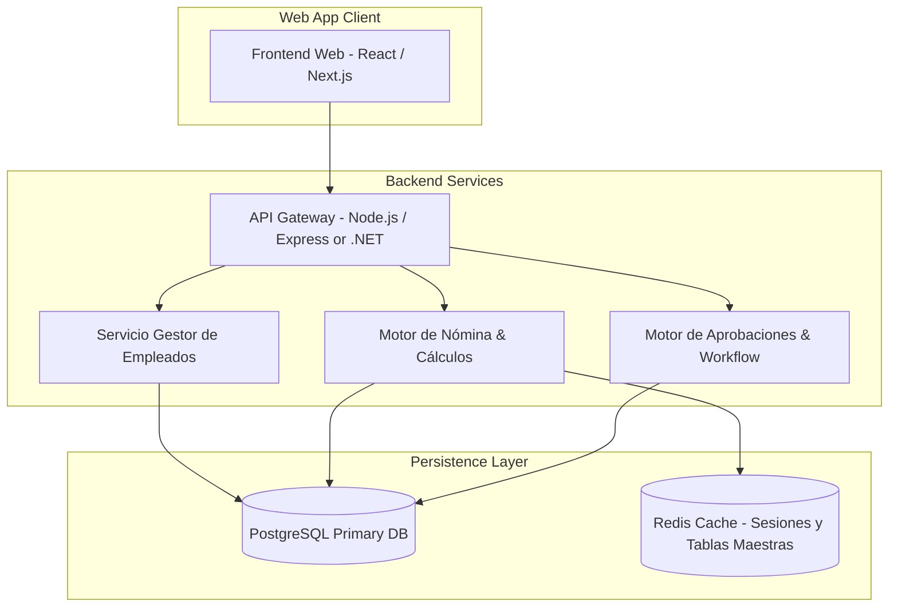

# Arquitectura General del Sistema ERP

## 1. Visión Holística

El ERP de RRHH y Nómina se diseña bajo una **Arquitectura Modular Orientada a Dominio (Domain-Driven Design / Modular Monolith o Microservicios)**, permitiendo escalabilidad técnica y aislamiento de dominios de negocio.

---

## 2. Diagrama de Contexto C4 (Nivel 1)

---

## 3. Diagrama de Contenedores C4 (Nivel 2)

---

## 4. Principios Arquitectónicos

1. **Separación de Responsabilidades (SoC)**: Interfaz, lógica de dominio y persistencia totalmente desacopladas.
2. **Inmutabilidad de Auditoría**: Todo cambio en estados de empleados, nómina y permisos genera un registro audit-log inalterable.
3. **Idempotencia de Operaciones**: Operaciones críticas como ejecución de nómina y generación de finiquitos deben ser idempotentes con tokens de control.
