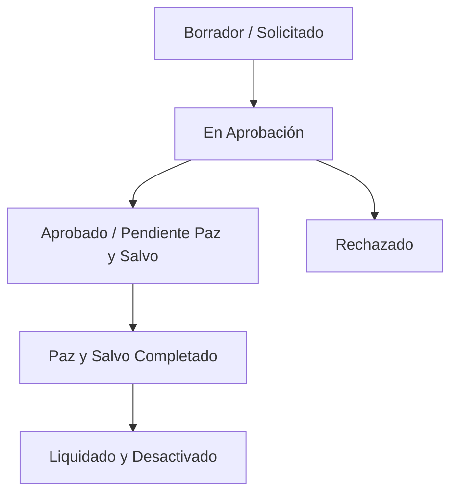

# Módulo Funcional: Desvinculación de Personal (Offboarding)

## 1. Objetivo
Definir las reglas de negocio, flujos operativos y requisitos funcionales para el proceso de desvinculación (renuncia, despido, jubilación o término de contrato) de los colaboradores dentro del ERP de RRHH.

---

## 2. Alcance
Aplica a todos los empleados activos registrados en la entidad `Empleado` (`xhrempmst`).

---

## 3. Reglas de Negocio (RN)

| Código | Regla de Negocio | Descripción |
| :--- | :--- | :--- |
| **RN-DES-001** | Notificación previa | Toda desvinculación debe ser notificada con al menos 30 días de anticipación salvo despido justificado o acuerdo mutuo. |
| **RN-DES-002** | Paz y Salvo Obligatorio | No se puede emitir el pago final de finiquito sin la aprobación de Paz y Salvo de: TI (equipos), Activos Fijos y Finanzas (préstamos pendientes). |
| **RN-DES-003** | Bloqueo de Acceso | Al registrar el estado `Inactivo - Desvinculado` en la fecha efectiva, los accesos a sistemas corporativos deben revocarse automáticamente vía integración LDAP/Active Directory. |
| **RN-DES-004** | Cálculo de Prestaciones | El finiquito incluye: Salario devengado, Vacaciones no disfrutadas proporcional, Prima/Aguinaldo proporcional e Indemnización si aplica. |

---

## 4. Tipos de Desvinculación

1. **Renuncia Voluntaria**: Inicia por parte del empleado. Requiere carta adjunta.
2. **Despido Justificado**: Inicia por RRHH. Requiere acta administrativa adjunta.
3. **Despido Injustificado / Mutuo Acuerdo**: Requiere aprobación de Dirección Ejecutiva y cálculo de indemnización legal.
4. **Jubilación / Pensionamiento**: Inicia por cumplimiento de requisitos legales de edad y tiempo cotizado.

---

## 5. Estados del Proceso de Desvinculación

---

## 6. Entidades Afectadas
- `Empleado` (`xhrempmst`): Cambio de estado a `INACTIVO`.
- `Finiquito` (`xhrfinhdr`, `xhrfindet`): Generación de orden de pago.
- `PazYSalvo` (`xhrpazsalv`): Lista de verificación de entrega de activos.
