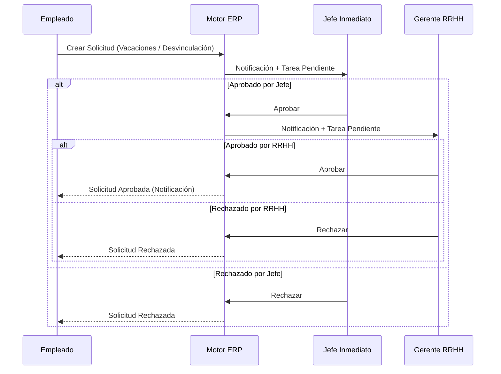

# Especificación de Workflows: Motor de Autorizaciones

## 1. Visión General
El motor de autorizaciones regula las solicitudes enviadas por los empleados (vacaciones, ausencias, préstamos, desvinculaciones) mediante cadenas de aprobación dinámicas.

---

## 2. Jerarquía de Aprobación Estándar

---

## 3. Reglas de Escalación por Tiempo (SLA)
- Si una solicitud permanece en estado `PENDIENTE_JEFE` por más de **48 horas hábiles**, el sistema enviará un recordatorio automático.
- Al cumplir **72 horas hábiles** sin respuesta, la solicitud se escala automáticamente al Superior Jerárquico del Jefe Inmediato.
